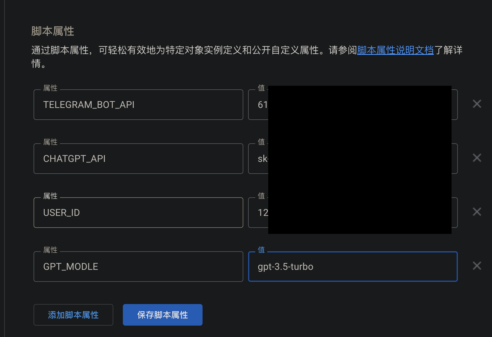
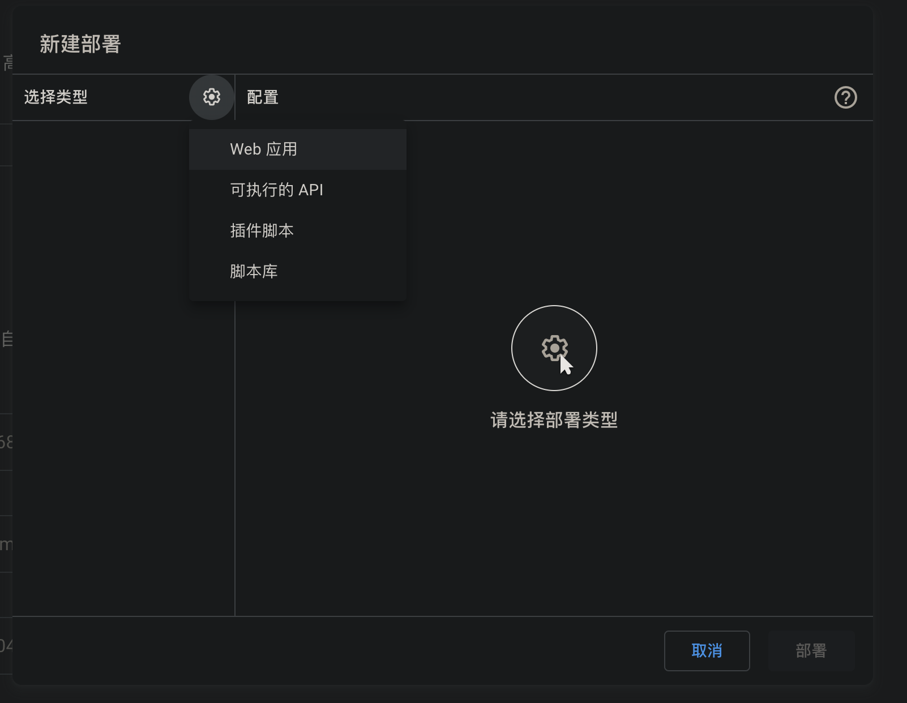
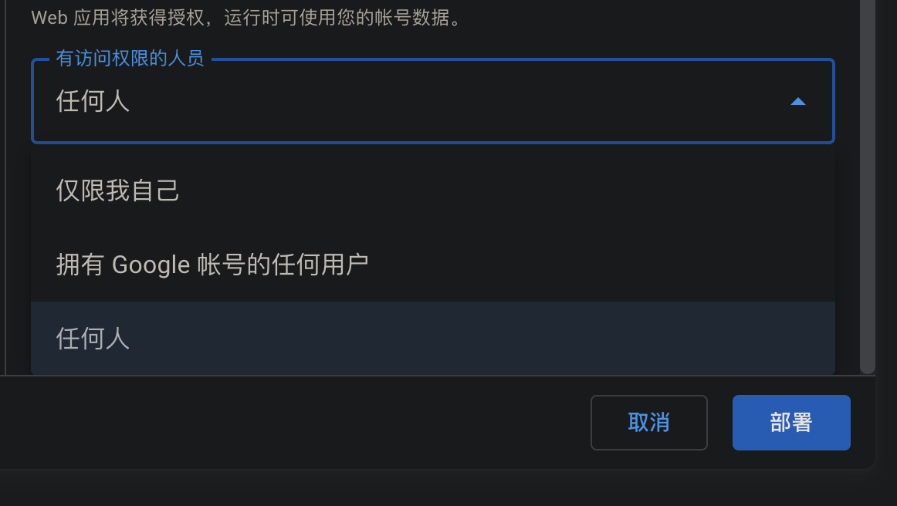
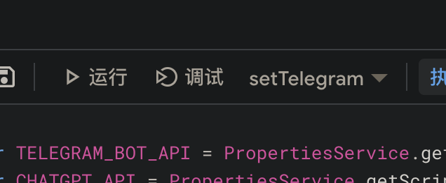

# iNeedGpt
ChatGPT Telegram Bot in Google Script

## How To Use
1. open  https://script.google.com/home/ && create
2. copy [GPT_Bot.gs](https://github.com/xieyangroy/iNeedGpt/blob/main/GPT_Bot.gs "GPT_Bot.gs") && Paste
3. get USER_ID please **@userinfobot**
4. 
5. 
6. copy url & Paste `var webhook_url = "";`
7. 
8. enjoy it
